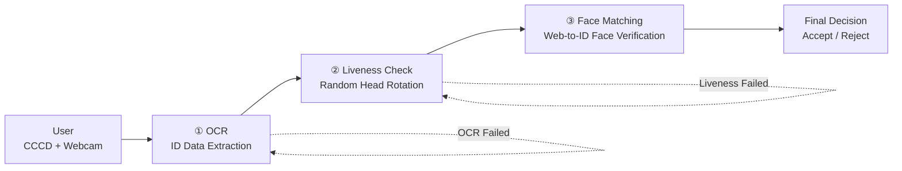

# eKYC — Electronic Know Your Customer

> An end-to-end identity verification system for Vietnamese Citizen ID Cards (CCCD), combining computer vision, deep learning, and liveness detection into a single deployable web application.

[](https://python.org)
[](https://djangoproject.com)
[](https://reactjs.org)
[](https://pytorch.org)
[](https://docker.com)
[](https://mongodb.com)

---

## Overview
https://github.com/user-attachments/assets/61890ef4-f02a-43a5-9981-83aedbbb3c8c

eKYC automates the identity verification workflow that banks, fintech platforms, and government services typically require a human agent to perform. A user submits photos of both sides of their Vietnamese National ID Card (CCCD), completes a real-time liveness challenge in front of their webcam, and receives an instant verification verdict, all without any manual review.

The system performs four distinct checks in sequence:

1. **ID Card OCR** — Extracts the data fields printed on the front of the card (ID number, name, DOB, gender, origin, residence, nationality) using a custom pipeline of YOLO-based text detection and VietOCR (VGG19_bn + Transformer) fine-tuned on Vietnamese scripts.
2. **Liveness Detection** — Issues randomized head-turn challenges (face left, face right, face front) captured in real-time via webcam. The backend classifies orientation using MTCNN landmark geometry. If any challenge matches, the session passes.
3. **Face Matching** — Compares the face cropped from the ID card photo against the webcam portrait using InceptionResnetV1, computing a similarity score via Euclidean distance with exponential decay normalization.

---

## Architecture

```
┌──────────────────────────────────────────────────────────────┐
│                        React Frontend                        │
│   UploadCard → CaptureFace → ViewResult                      │
│   (react-webcam, react-router-dom, axios)                    │
└───────────────────────┬──────────────────────────────────────┘
                        │ HTTP / JSON / multipart
┌───────────────────────▼──────────────────────────────────────┐
│                    Django REST Backend                       │
│                                                              │
│  /api/ocr_vic/              OCRVIC pipeline                  │
│  /api/challenge_response/   Face Recognition + Orientation   │
│  /api/face_verification/    Face Matching                    │
│  /api/check_id_exists/      MongoDB duplicate check          │
│  /api/save_view_result/     Persist full verification record │
└──────┬────────────────────────────────────────┬──────────────┘
       │                                        │
┌──────▼──────────┐                  ┌──────────▼──────────────┐
│   AI/ML Layer   │                  │       MongoDB           │
│                 │                  │  (djongo ORM adapter)   │
│ YOLOv8(corners) │                  │                         │
│ YOLOv8(texts)   │                  │  ViewResult collection  │
│ QRDetector      │                  │  - OCR fields           │
│ VietOCR         │                  │  - face similarity score│
│ MTCNN           │                  │  - images (base64)      │
│ InceptionResV1  │                  │  - accepted flag        │
└─────────────────┘                  └─────────────────────────┘
```

## Workflows 
##### Overall Flow


##### OCR Workflow
```text
ID Card Image
   │
   ▼
Corner Detection (YOLO)
   │  Detects 4 card corners; reconstructs missing corner
   │  algebraically if only 3 are found
   ▼
Perspective Transformation (OpenCV + QRDetector)
   │  Uses the card's embedded QR code as a spatial reference
   │  to order corners correctly before warpPerspective
   ▼
Text Detection (YOLO)
   │  Locates each labeled field bounding box (class 0-6)
   │  Filters by brightness to skip blank regions
   ▼
Text Recognition (VietOCR — VGG19_bn + Transformer)
   │  Runs VGG19_bn CNN feature extractor → 6-layer
   │  encoder-decoder Transformer with Vietnamese vocabulary
   ▼
Dict[class_id → text]  (returned to API caller)
```
##### Liveness Detection Workflow

```text
Random Challenge Generation
   │
   │  Server randomly selects one challenge:
   │  face left, face right, or face front
   ▼
Webcam Frame Capture (react-webcam)
   │
   │  Frontend captures live webcam frames
   │  and sends snapshots to the backend
   ▼
Landmark Detection (MTCNN)
   │
   │  Detects the face and extracts 3 facial landmark coordinates,
   │  including the left eye, right eye, and nose 
   ▼
Head Orientation Classification
   │
   │  Computes facial geometry using landmarks
   │  and estimates head orientation
   ▼
Challenge Verification
   │
   │  Compares predicted orientation against
   │  the randomly assigned challenge
   ▼
PASS / RETRY
```
##### Face Matching Workflow

```text
ID Card Portrait + Webcam Portrait
   │
   │  Receives the cropped face from the CCCD
   │  and the live face captured from webcam
   ▼
Face Preprocessing
   │
   │  Resize images to 160×160 pixels
   │  Normalize pixel values to [-1, 1]
   │  Convert images to PyTorch tensors
   ▼
Feature Extraction (InceptionResnetV1)
   │
   │  Generates 512-dimensional face embeddings
   │  using a model pretrained on VGGFace2
   ▼
Euclidean Distance Computation
   │
   │  Computes the L2 distance between
   │  the two face embeddings
   ▼
Similarity Score Calculation
   │
   │  Applies exponential decay normalization
   │  to convert distance into a score (0–100)
   ▼
Face Verification Result
   │
   ├─ PASS  → Verification ✓ 
   ├─ FAIL  → Rejected ✗
   │
   ▼
Record saved to MongoDB 
```
---

## Tech Stack

| Layer | Technology | Purpose |
|---|---|---|
| Frontend | React 19, react-webcam, react-router-dom | Multi-step UI flow, webcam access |
| Backend | Django 3.1, django-cors-headers | REST API, request routing |
| Database | MongoDB 6 via djongo | Verification record persistence |
| Card corners | YOLOv8 (ultralytics) | 4-class corner keypoint detection |
| QR detection | QRDetector (qrdet) | QR-based card orientation disambiguation |
| Text detection | YOLOv8 (ultralytics) | Detects labeled text field regions |
| Text recognition | VietOCR (VGG19_bn + Transformer) | Extracts Vietnamese text from detected regions |
| Face detection | MTCNN (facenet-pytorch) | Face localization and 3-point landmark extraction |
| Face matching | InceptionResnetV1 (facenet-pytorch) | Face similarity comparison |
| Containerization | Docker Compose | Multi-service local deployment |

---

## Folder Structure

```
ekyc/
├── backend/
│   ├── ekyc_project/          # Django project config
│   │   ├── settings.py        # DB, CORS, installed apps
│   │   ├── urls.py            # Root URL dispatch
│   │   └── wsgi.py
│   └── ekyc_app/              # Main application
│       ├── models.py          # ViewResult model (Djongo → MongoDB)
│       ├── views.py           # 5 API endpoints, model singletons
│       ├── urls.py            # App-level URL patterns
│       ├── configs/
│       │   └── config_text_recognition.yml   # VietOCR training config
│       ├── services/
│       │   ├── corner_detection.py           # YOLO corner keypoints
│       │   ├── perspective_transformation.py # CV2 warp + QR anchor
│       │   ├── text_detection.py             # YOLO field detection
│       │   ├── text_recognition.py           # VietOCR predictor wrapper
│       │   ├── ocr_vic.py                    # Orchestrates full OCR pipeline
│       │   ├── face_recognition.py           # MTCNN detector + crop
│       │   ├── face_orientation.py           # Landmark angle classifier
│       │   └── face_matching.py              # InceptionResV1 similarity
│       ├── weights/                          # Model weight files
│       │   ├── corner_detection.pt
│       │   ├── text_detection.pt
│       │   └── text_recognition.pth
│       ├── requirements.txt
│       └── manage.py
├── frontend/
│   └── src/
│       ├── App.js                 # Route definitions
│       └── Components/
│           ├── UploadCard.jsx     # Step 1: ID card upload + OCR trigger
│           ├── CaptureFace.jsx    # Step 2: Webcam liveness + face match
│           └── ViewResult.jsx     # Step 3: Final verdict display + save
├── Dockerfile.backend
├── Dockerfile.frontend
└── docker-compose.yml
```

---

## Setup & Running

### Prerequisites

- Docker and Docker Compose
- MongoDB instance (local or remote — URI goes in `.env`)
- Model weights placed under `backend/ekyc_app/weights/`:
  - `corner_detection.pt`
  - `text_detection.pt`
  - `text_recognition.pth`

### Environment Variables

Create a `.env` file in the project root:

```env
DJANGO_SECRET_KEY='your-secret-key-here'
DJANGO_DEBUG=True
MONGO_URI=mongodb://host.docker.internal:27017/ekyc_db
PYTHONUNBUFFERED=1
```


### Docker Compose (recommended)

```bash
git clone <repo-url>
cd ekyc
docker-compose up --build
```

Services will start on:
- Frontend: http://localhost:3000
- Backend API: http://localhost:8000
- MongoDB: localhost:27017

### Local Development (without Docker)

**Backend:**

```bash
cd backend
python -m venv venv
source venv/bin/activate   
pip install -r requirements.txt
python manage.py migrate
python manage.py runserver
```

**Frontend:**

```bash
cd frontend
npm install
npm start
```
---

## API Reference

All endpoints are under `/api/`.

### `POST /api/ocr_vic/`
Extracts text fields from the front of a CCCD card.

- **Body:** `multipart/form-data` with `frontImage` file
- **Response:**
```json
{
  "result": {
    "0": "079204XXXXXX",
    "1": "Việt Nam",
    "2": "Nguyễn Văn A",
    "3": "Nam",
    "4": "01/01/1990",
    "5": "Hà Nội",
    "6": "123 Đường ABC, Phường XYZ"
  }
}
```

### `POST /api/challenge_response/`
Checks if the user's face orientation matches the issued challenge.

- **Body:** `application/json`
```json
{ "image": "<base64-encoded-jpeg>", "challenge": "left" }
```
- **Response:** `{ "result": true }`

### `POST /api/face_verification/`
Computes similarity between the ID card face and the live webcam capture.

- **Body:** `multipart/form-data` with `idImage` and `faceImage`
- **Response:** `{ "result": 87.43 }` (score 0–100; ≥80 passes)

### `POST /api/check_id_exists/`
Checks whether an ID number already exists in the database.

- **Body:** `{ "ocr_id": "079204XXXXXX" }`
- **Response:** `{ "result": false }` (false = ID is new)

### `POST /api/save_view_result/`
Persists the complete verification session to MongoDB.

---

## Technical Challenges

**Corner detection with missing keypoints.** YOLO sometimes fails to detect all four card corners when lighting or angle is poor. Rather than failing outright, the system reconstructs the missing corner algebraically: `missing = 2 × midpoint(a, b) − c`, where `a`, `b`, `c` are the three detected corners whose geometric relationship implies the fourth. This keeps the OCR pipeline functional across a wide range of input quality.

**Card orientation disambiguation.** Perspective transformation requires knowing which corner is which — top-left vs. top-right matters. Sorting corners purely by position is ambiguous when the card is rotated significantly. The solution anchors orientation to the card's embedded QR code: the corner nearest to the QR center is always the bottom-right, which unambiguously orders all four corners before the `cv2.getPerspectiveTransform` call.

**Vietnamese OCR.** Standard English-trained OCR models fail catastrophically on Vietnamese text because of the language's extensive diacritic system (over 130 distinct glyphs). The text recognition module uses VietOCR — a VGG19_bn CNN feeding into a 6-layer encoder-decoder Transformer with a Vietnamese-specific vocabulary of ~200 characters. The pretrained weights (`vgg_transformer.pth`) are sourced from vocr.vn.

**Face orientation from 2D landmarks.** There's no depth information available from a standard webcam frame. Head orientation is instead derived from the angular relationships between the left eye, right eye, and nose landmarks detected by MTCNN. The angle between the eye-to-eye vector and the eye-to-nose vector differs measurably between frontal and profile views — the implementation gates on `25° ≤ angle ≤ 60°` for "frontal" and compares the left-eye and right-eye angles to determine left/right tilt.

**Similarity scoring from Euclidean distance.** Raw Euclidean distance between face embeddings isn't directly interpretable as a percentage. The conversion uses `score = 100 × exp(-0.8 × (d − 0.6))`, an exponential decay centered at the empirically determined threshold distance of 0.6. This maps the typical "same person" distance range (0.3–0.8) to a 0–100 scale in a way that's intuitive to display.

---


## License

This project is licensed under the MIT License and incorporates several open-source libraries and models, including:
* React
* Django
* MongoDB
* Ultralytics YOLOv8
* VietOCR
* facenet-pytorch
* qrdet
* Docker
